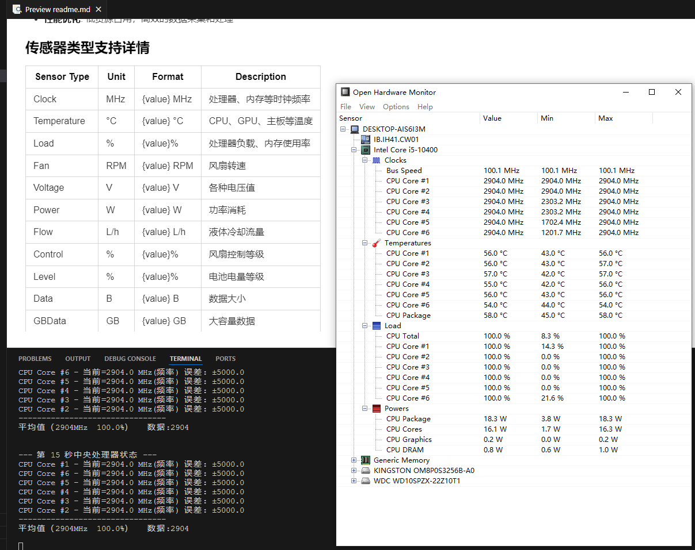
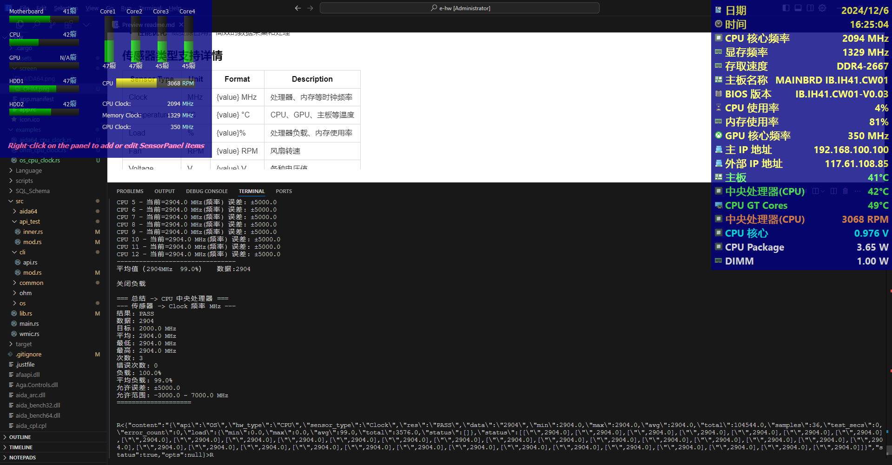
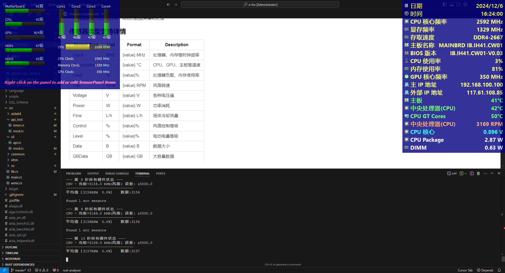
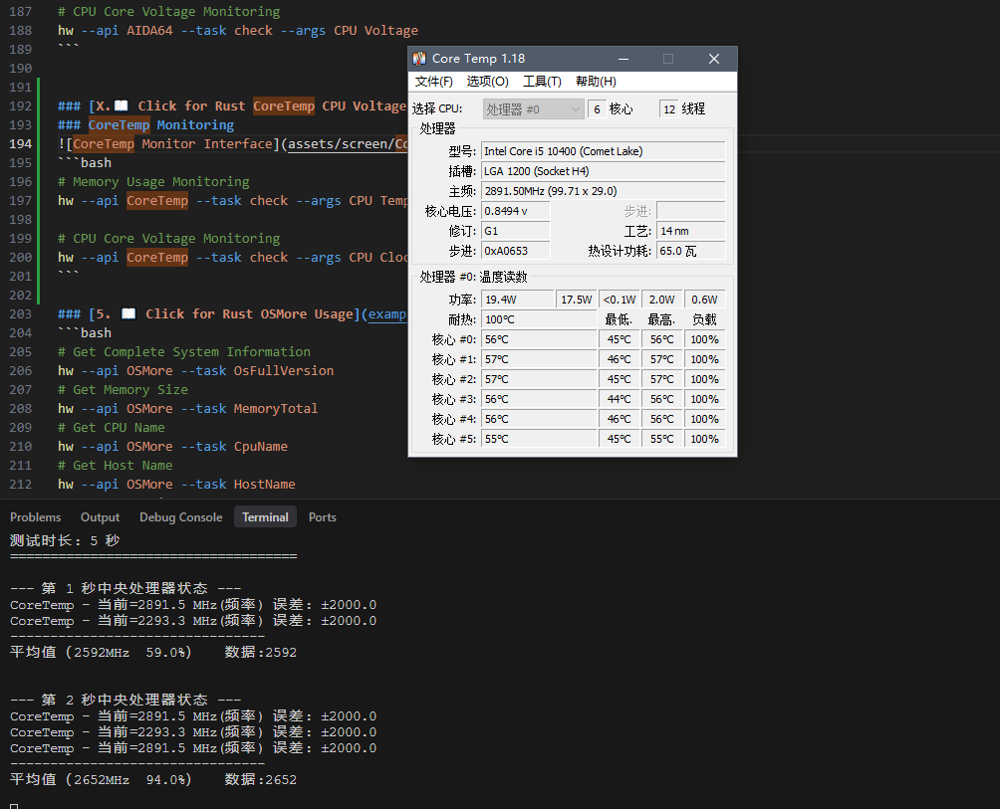

<div align="center">
  
  <h1>HW Monitor</h1>
  <p><strong>Powerful and Unified Cross-Platform Hardware Monitoring Tool</strong></p>
</div>

<div align="center">
  
[](https://github.com/eternalnight996/hw)[](https://docs.rs/hw)[](LICENSE)

[](https://github.com/eternalnight996/hw/actions/workflows/ci.yml)

English | [简体中文](readme.zh.md)

</div>

## ✨ Features

- 🔄 **Multiple Backend Integration** - Supports OpenHardwareMonitor, AIDA64, sysinfo and other monitoring solutions
- 🌍 **Cross-Platform Support** - Full support for Windows, basic support for Linux/MacOS
- 📊 **Rich Monitoring Metrics** - Comprehensive monitoring of CPU, GPU, Memory, Hard Drive, Motherboard, etc.
- ⚡ **Real-time Data Collection** - Millisecond-level hardware status monitoring
- 🔌 **Unified Interface** - Simple command-line tools and Rust API
- 🛠 **Extensible Architecture** - Easy to extend new monitoring backends
- 📈 **Performance Optimization** - Low resource usage, efficient data processing

## 🚀 Quick Start

### Install via Cargo
```bash
cargo install hw
```

### Build from Source
```bash
git clone https://github.com/eternalnight996/hw.git
cd hw
cargo install just
just
```

> 运行日志以 e-log（tracing）方式输出：按天滚动写入 `logs/hw-*.log`（含时间戳+级别），控制台输出到 **stderr**；stdout 仅保留 `R<...>R` 协议行，etest 解析不受日志干扰。

> CI (GitHub Actions) covers: `cargo check --all-features`, `--no-default-features --features "cli,log"`, `--features "ohm,cli,log"`, and `cargo test` (lib + doc).

**Default launch is the GUI**: `cargo run` (or `target\\debug\\hw-gui.exe`) opens the desktop app with three views — Live Monitoring / Check / etest Rules. The CLI tool remains `hw` (e.g. `hw --api Test --task list`).

**Command Differences:**
- **data**: Only returns current sensor values
- **print**: Returns complete statistics without validation
- **check**: Performs value range validation and load testing
  - `10`: Number of tests
  - `2000`: Target value
  - `3000`: Error range (-1000~5000)
  - `100`: CPU load percentage

---
### 📖 Features
```toml
[dependencies]
# All features
hw = {version="0.1"}
# Package all features
hw = {version="0.1",feature=["build","built"]}
# OHM only
hw = {version="0.1", default-features = false, feature=["ohm"]}
# Add cli for command line
# Log supports log and tracing, cli defaults to println output
hw = {version="0.1", default-features = false, feature=["ohm","cli","log"]}
```

---
## 📸 Interface Preview and Command Examples

### [1. 📖 Click for Rust CLI Usage](examples/cli.rs)
### [2. 📖 Click for Rust OHM CPU Clock Usage](examples/ohm_cpu_clock.rs)
### OpenHardwareMonitor Monitoring

**CPU Clock Monitoring Example**

1. **data command** - Returns current value only
```bash
hw --api OS --task data --args CPU Clock
```
```text
   Compiling hw v0.1.2 (D:\MyApp\hw)
    Finished `dev` profile [unoptimized + debuginfo] target(s) in 4.18s
     Running `target\x86_64-pc-windows-msvc\debug\hw.exe --api OHM --task data --args CPU Clock`
Started OpenHardwareMonitor.exe with PID: 5332
Loading... (100%/100%)
...
--------------------------------
Average（1068MHz  0.0%）   Data:1068

Close Load

=== Summary -> CPU Central Processing Unit ===
--- Sensor -> Clock Frequency MHz ---
Result: PASS
Data: 1068
Target: 0.0 MHz
Average: 1068.0 MHz
Minimum: 901.2 MHz
Maximum: 1101.5 MHz
Count: 1
Error Count: 0
Load: 0.0%
Average Load: 0.0%
Allowed Error: ±0.0
Allowed Range: 0.0 ~ 0.0 MHz
====================


R<{"content":"1068","status":true,"opts":null}>R
```

2. **print command** - Returns complete statistics
```bash
hw --api OHM --task print --full --args CPU Clock
```
```text
...

R<{"content":"{\"api\":\"OHM\",\"hw_type\":\"CPU\",\"sensor_type\":\"Clock\",\"res\":\"PASS\",\"data\":\"1102\",\"min\":1101.5174560546875,\"max\":1101.5174560546875,\"avg\":1102.0,\"total\":6609.104736328125,\"samples\":6,\"test_secs\":0,\"error_count\":0,\"load\":{\"min\":0.0,\"max\":0.0,\"avg\":0.0,\"total\":0.0,\"status\":[]},\"status\":[...]}","status":true,"opts":null}>R
```

3. **check command** - Performs value range validation and load testing
```bash
hw --api OHM --task check --full --args CPU Clock -- 10 2000 3000 100
```
```text
...

--- CPU Status at Second 10 ---
CPU Core #1 - Current=2904.0 MHz(Frequency) Error: ±3000.0
CPU Core #6 - Current=2904.0 MHz(Frequency) Error: ±3000.0
CPU Core #5 - Current=2904.0 MHz(Frequency) Error: ±3000.0
CPU Core #4 - Current=2904.0 MHz(Frequency) Error: ±3000.0
CPU Core #3 - Current=2904.0 MHz(Frequency) Error: ±3000.0
CPU Core #2 - Current=2904.0 MHz(Frequency) Error: ±3000.0
--------------------------------
Average（2904MHz  99.0%）   Data:2904

Close Load

=== Summary -> CPU Central Processing Unit ===
--- Sensor -> Clock Frequency MHz ---
Result: PASS
Data: 2904
Target: 2000.0 MHz
Average: 2904.0 MHz
Minimum: 2904.0 MHz
Maximum: 2904.0 MHz
Count: 10
Error Count: 0
Load: 100.0%
Average Load: 99.0%
Allowed Error: ±3000.0
Allowed Range: -1000.0 ~ 5000.0 MHz
====================


R<{"content":"{\"api\":\"OHM\",\"hw_type\":\"CPU\",\"sensor_type\":\"Clock\",\"res\":\"PASS\",\"data\":\"2904\",\"min\":2904.000732421875,\"max\":2904.001708984375,\"avg\":2904.0,\"total\":174240.07470703125,\"samples\":60,\"test_secs\":0,\"error_count\":0,\"load\":{\"min\":0.0,\"max\":0.0,\"avg\":99.0,\"total\":5946.0,\"status\":[]},\"status\":[...]}","status":true,"opts":null}>R 
```

```bash
# CPU Temperature Monitoring
hw --api OHM --task check --args CPU Temperature

# CPU Frequency Test (5 times, target 3000MHz, error ±2000MHz, 100% load)
hw --api OHM --task check --args CPU Clock -- 5 3000 2000 100

# Fan Speed Test (5 times, target 3000RPM, error ±2000RPM)
hw --api OHM --task check --args ALL Fan -- 5 3000 2000
```

### [3.📖 Click for Rust OS CPU Clock Usage](examples/os_cpu_clock.rs)
### sysinfo Monitoring

```bash
# Overall System Status
hw --api OS --task print

# CPU Load Monitoring
hw --api OS --task check --args CPU Load
```

### [4.📖 Click for Rust AIDA64 CPU Voltage Usage](examples/aida64_cpu_voltage.rs)
### AIDA64 Monitoring

```bash
# Memory Usage Monitoring
hw --api AIDA64 --task check --args RAM Load

# CPU Core Voltage Monitoring
hw --api AIDA64 --task check --args CPU Voltage
```

### [X.📖 Click for Rust CoreTemp CPU Voltage Usage](examples/core_temp.rs)
### CoreTemp Monitoring

```bash
# Memory Usage Monitoring
hw --api CoreTemp --task check --args CPU Temperature

# CPU Core Voltage Monitoring
hw --api CoreTemp --task check --args CPU Clock
```

### [5. 📖 Click for Rust OSMore Usage](examples/os_more_base.rs)
```bash
# Get Complete System Information
hw --api OSMore --task OsFullVersion 
# Get Memory Size
hw --api OSMore --task MemoryTotal 
# Get CPU Name
hw --api OSMore --task CpuName
# Get Host Name
hw --api OSMore --task HostName
# Get OS Version
hw --api OSMore --task OsVersion
```

### [6. 📖 Click for Rust Microsoft Office Usage](examples/os_office.rs)
```bash
# Get Office Version
hw --api OSOffice --task check-with-cache --args V2016 test
```

### [7. 📖 Click for Rust Microsoft System Activation Usage](examples/os_system.rs)
```bash
# Activate System
hw --api OSSystem --task active --args XXXXX-XXXXX-XXXXX-XXXXX-XXXXX activation_temp
# Check System Activation Status and Query Activation Code Cache
hw --api OSSystem --task check-with-cache --args activation_temp
```

### [8. 📖 Click for Rust Export DLL|SO Dynamic Library Usage](examples/file_info.rs)
```bash
# Export DLL|SO Dynamic Library
hw --api FileInfo --task copy-lib --args target/debug/hw.exe target/debug/_libs
# Print File Nodes
hw --api FileInfo --task print --args target/debug/hw.exe
# Print File Nodes
hw --api FileInfo --task nodes --args target/debug/hw.exe
```

### [9. 📖 Click for Rust PING Usage](examples/ping.rs)
```bash
# Test PING
hw --api OSMore --task NetManage  --args ping 127.0.0.1 baidu.com 
# Test PING Nodes
hw --api OSMore --task NetManage --args ping-nodes baidu.com 3 -- ~is_connected Ethernet
```

### [10. 📖 Click for Rust Set DHCP Usage](examples/dhcp.rs)
```bash
# Set DHCP ~is_connected means the currently connected network card
hw --api OSMore --task NetManage --args dhcp -- ~is_connected
```

### [11. 📖 Click for Rust Set Static IP Usage](examples/static_ip.rs)
```bash
# Set Static IP
hw --api OSMore --task NetManage  --args set-ip 192.168.1.100 255.255.255.0 192.168.1.1 -- "以太网"
# Set DNS
hw --api OSMore --task NetManage  --args set-dns 223.5.5.5 114.114.114.114 "以太网" Ethernet  ~is_connected
```

### [12. 📖 Click for Rust Desktop Usage](examples/desktop.rs)
```bash
# Desktop Nodes
hw --api OSMore --task Desktop --args nodes
# Print
hw --api OSMore --task Desktop --args print
```

### [13. 📖 Click for Rust Drive Usage](examples/drive.rs)
```bash
# Scan Drives
hw --api Drive --task scan
# Print Drive
hw --api Drive --task print -- =net "*I225-V #6"
hw --api Drive --task print -- "@pci*" "*I225-V #6"
hw --api Drive --task print -- "@pci*" "PCI*" "*E0276CFFFFEEA86B00"
  # --full Complete data but more resource consuming, recommended to use = and @ for filtering
hw --api Drive --task print --full -- =net "*I225-V #6" 
# Drive Nodes
hw --api Drive --task nodes -- =net
# Export Drive
hw --api Drive --task export --args oem6.inf D:\\drives
hw --api Drive --task export --args oem*.inf .
# Restart Drive
hw --api Drive --task restart -- =net "Intel(R) Ethernet Controller (3) I225-V #5"
hw --api Drive --task restart -- "@PCI\VEN_8086&DEV_15F3&SUBSYS_00008086&REV_03\E0276CFFFFEEA86A00"
# Enable Drive
hw --api Drive --task enable -- =net "Intel(R) Ethernet Controller (3) I225-V #5"
# Disable Drive
hw --api Drive --task disable -- "@PCI\VEN_8086&DEV_15F3&SUBSYS_00008086&REV_03\E0276CFFFFEEA86A00"
# Delete Drive
hw --api Drive --task delete -- "@PCI\VEN_8086&DEV_15F3&SUBSYS_00008086&REV_03\E0276CFFFFEEA86A00"
# Add Drive
hw --api Drive --task add  --args D:\\drives\\oem6.inf /install
# Add Drive Folder
hw --api Drive --task add-folder --args D:\\drives /install
# Check Drive Status
hw --api Drive --task check-status
# Print Drive Status
hw --api Drive --task print-status
# Print Drive Status Full
hw --api Drive --task print-status --full
# Print Drive Status Nodes
hw --api Drive --task print-status --nodes
# Print Drive Status Nodes Full
hw --api Drive --task print-status --nodes --full
```

### [14. 📖 Click for Rust Sync Time Usage](examples/sync_datetime.rs)
```bash
# Sync Time
hw --api OSMore --task NetManage --args sync-datetime time.windows.com
```

### [15. 📖 Click for Rust Network Interface Usage](examples/net_interfaces.rs)
```bash
# "~Less100" Speed less than 100
# "~100" Speed greater than or equal to 100
# "~1000" Speed greater than or equal to 1000
# "~Big1000" Speed greater than or equal to 10000
# "~is_connected" Currently connected
# "~has_dhcp_ip" Has DHCP IP

# Check MAC Duplication and Initialize
hw --api OSMore --task NetInterface --args check-mac "*I225-V #1" -- ~has_dhcp_ip
# Network Interface
hw --api OSMore --task NetInterface --args print  -- ~has_dhcp_ip
# Network Interface Nodes
hw --api OSMore --task NetInterface --args nodes  -- ~has_dhcp_ip
```
### [16. 📖 Click for Rust Disk Usage](examples/disk.rs)
```bash
# Get Disk Data
hw --api Disk --task data --args C:
# Get Disk Mount Tree
hw --api Disk --task mount-tree --args C:
# Check Disk Load
hw --api Disk --task check-load --args 10 90
```
---
### [17. 📖 Click for Rust Test Modes](src/test_mode/)
### Test Modes (pluggable test framework, inspired by TrafficMonitor's plugin interface)
```bash
# List all registered modes
hw --api Test --task list

# Network upload/download rate (B/s), 5 samples
hw --api Test --task net-speed --args print -- 5

# CPU usage check: 5s, target 80%, ±10%, with 60% load
hw --api Test --task cpu-usage --args check --filter CPU_Usage_Global -- 5 80 10 60

# Memory usage, single data point
hw --api Test --task mem-usage --args data

# Disk used% and IO rates
hw --api Test --task disk-usage --args print -- 3

# Temperature (°C) and GPU utilization (need OHM/LHM/AIDA64 in plugins/)
hw --api Test --task temp --args print -- 3
hw --api Test --task gpu-usage --args check --filter "GPU Core" -- 5 90 10
```
The verb is the first `--args` value (`data` / `print` / `check`, default `print`); test params follow `--` as `<secs> <target> <error> <load%>`; `--filter` restricts which metrics are validated/emitted.

**Adding a new mode** = 1 module + 1 registration line (no dispatcher changes):
1. Implement `TestMode` (name/description/create) + `ModeInstance` (sample; optional setup/teardown/spawn_load)
2. Add a `pub static MODE: XxxMode = XxxMode;`
3. Register in `src/test_mode/builtin/mod.rs` (one line)

See [src/test_mode/mod.rs](src/test_mode/mod.rs) for the trait docs.
---
### [18. 📖 GUI — hw-gui (eframe/egui desktop app)](src/bin/hw-gui.rs)
A desktop GUI (`hw-gui`) built with eframe/egui, modeled on TrafficMonitor's floating-window style:

- **Live monitoring** — continuously samples the registered test modes (net-speed, cpu-usage, mem-usage, disk-usage, temp, gpu-usage) and plots each metric over time
- **Check visualization** — run `check` with target/±error/load, watch per-second samples against the target band, live PASS/FAIL
- **History & export** — every check run is recorded to `hw-gui-history.json`; export JSON/CSV reports
- **etest rules panel** — the unified `hw-config.json` plan is auto-loaded and run from the GUI with per-rule progress/curve and PASS-FAIL table; export the same report JSON as the CLI (see section 19)

```bash
# Build (the gui feature adds eframe/egui_plot; requires rustc >= 1.95)
cargo build --features gui --bin hw-gui

# Run
target\debug\hw-gui.exe

# Automated smoke test: auto-close the window after 3 seconds
set HW_GUI_SMOKE=1 && target\debug\hw-gui.exe
```

Temperature/GPU modes need OHM/LHM/AIDA64 executables under `plugins/` (see section 17); the first start of those modes may take up to ~20 s to launch the backend. Other modes work out of the box.
---
### [19. 📖 etest Test Platform Integration](src/test_mode/rules.rs)
Production testing is driven by the **etest** platform, which invokes `hw.exe` via CLI and parses the `R<...>R`-wrapped JSON on stdout:

```text
R<{"content":"...","status":true,"opts":null}>R
```

`status` = overall PASS/FAIL; `content` = rule report JSON (see below).

> 规则/配置格式参考兄弟项目 **MVCheck**（机内视觉检查上位机，`Conf.json` 模式）：随仓库提供模板文件、首次运行自动生成、etest 直接编辑。

**Test rules — the `plan` section of the unified `hw-config.json`** (one file for etest: `gui` = run behavior, `plan` = test rules). One entry per test item with its limits:

| Field | Meaning | Example |
| --- | --- | --- |
| `id` | Test item id (unique) | `net-up` |
| `mode` | Registered test mode (section 17) | `net-speed` |
| `metric` | Metric name contains-match; empty = all metrics must pass | `Total_Rx` |
| `unit` | Optional unit check | `B/s` |
| `min` / `max` | Lower/upper limit, judged on sampling **average**; omitted = unlimited | `1000000` / `null` |
| `max_std` | **Stability**: max standard deviation σ; omitted = unlimited | `2.0` |
| `secs` | Sampling seconds (default 3) | `5` |
| `load` | Load % (default 0) | `0` |

`plan` template (the committed `hw-config.json` contains `gui` + this `plan`):

```json
{
  "name": "my-plan",
  "rules": [
    { "id": "net-up", "mode": "net-speed", "metric": "Total_Rx", "unit": "B/s", "min": 1000000, "max": null, "max_std": null, "secs": 5, "load": 0 },
    { "id": "ram-usage", "mode": "mem-usage", "metric": "RAM_Usage", "unit": "%", "min": null, "max": 90, "max_std": 2.0, "secs": 3, "load": 0 }
  ]
}
```

**Commands:**

```bash
# Generate / refresh the rule template
# Regenerate the unified config template (gui + plan)
hw --api Test --task config-template --args hw-config.json

# Execute the plan inside hw-config.json (or a bare rule file)
hw --api Test --task run-rules --args hw-config.json
```

Report JSON in `content` (per item): `{plan, status, results:[{item, mode, metric, unit, value, avg, min, max, std_dev, samples, min_limit, max_limit, max_std_limit, pass, message}]}`. Field names can be adapted to the official etest schema when provided.

The GUI's **etest 规则 (Rules)** view loads the same rule file, runs each rule with live progress/curves, and exports the identical report JSON — the final production test can run entirely from the GUI.

**Full item reference** (per-item limits are suggestions — adjust to your product):

| 功能项 | mode | metric（建议） | 建议上限/说明 |
| --- | --- | --- | --- |
| CPU 主频 | `cpu-clock` | 任意（空=全部核心） | MHz，稳定性可加 `max_std` |
| CPU 温度 | `temp` | `CPU Package` | ≤ 85 °C |
| GPU 温度 | `temp` | `GPU` | ≤ 90 °C |
| 主板温度 | `temp` | `Mainboard` | ≤ 60 °C |
| 风扇转速 | `fan-speed` | 任意（空=全部风扇） | 建议 `min` ≥ 500 RPM |
| 电压 | `voltage` | 任意 | V，按规格填 min/max |
| 功率 | `power` | 任意 | W，按规格填 max |
| CPU 利用率 | `cpu-usage` | `CPU_Usage_Global` | % |
| 内存利用率 | `mem-usage` | `RAM_Usage` | ≤ 90 %，稳定性 `max_std` |
| 磁盘占用 | `disk-usage` | `C: Used%` | ≤ 90 % |
| 网速 | `net-speed` | `Total_Rx` / `Total_Tx` | B/s，按需 `min` |
| GPU 利用率 | `gpu-usage` | 任意 | % |

---
### [20. 📖 Unified Config Table (`hw-config.json`, one file for etest debugging)](src/gui_config.rs)
etest/operators edit the **single file `hw-config.json`** (auto-created on first run) — `gui` section controls run behavior, `plan` section holds the test rules. No code changes needed:

| Field | Meaning | Default |
| --- | --- | --- |
| `default_view` | Startup view: `live` / `check` / `rules` | `rules` |
| `auto_run` | Auto-start rule execution after launch | `true` |
| `run_seconds` | Total test duration cap (seconds); `0` = unlimited (each rule keeps its own `secs`); remaining rules are marked timeout when exceeded | `0` |
| `auto_close` | Auto-close the window when the test completes | `true` |
| `exit_code_on_fail` | Return process exit code `1` on test failure (etest can judge without parsing; only applies with `auto_close`) | `true` |
| `raise_load_percent` | Global load %; >0 becomes the default load for rules without explicit load (and the Check default) | `0` |
| `display_mode` | `all` = show every metric; `single` = only `display_metrics` | `all` |
| `display_metrics` | Metric name contains-match list used when `display_mode=single` (e.g. `["CPU_0_Clock"]` for CPU frequency, `["CPU_Usage_Global"]`) | `[]` |
| `check_params` | Check 测试默认参数（etest 可直接修改）：`{secs, target, error, load}` | `{5, 1000, 500, 0}` |
| `log_file` | Test result log file — the `R<...>R` result is appended here (supports `{origin}`/`{env:KEY}`, empty = no file) | `hw-gui-test.log` |

```json

```

Example — production one-shot: start at the rules view, run the `plan`, raise 60% load, watch only CPU frequency/usage, close with exit code when done:

```json
{
  "gui": {
    "default_view": "rules",
    "auto_run": true,
    "run_seconds": 60,
    "auto_close": true,
    "exit_code_on_fail": true,
    "raise_load_percent": 60,
    "display_mode": "single",
    "display_metrics": ["CPU_0_Clock", "CPU_Usage_Global"],
    "check_params": { "secs": 5, "target": 1000, "error": 500, "load": 0 },
    "log_file": "hw-gui-test.log"
  },
  "plan": { "name": "全项产测", "rules": [ ... 12 items ... ] }
}
```
---
## 🚀 Development Progress
<table>
  <tr>
    <th>Backend</th>
    <th>Windows</th>
    <th>Linux</th>
    <th>MacOS</th>
    <th>Status</th>
    <th>Description</th>
    <th>Supported Features</th>
  </tr>
    <tr>
    <td>CoreTemp</td>
    <td>
      <h4 style="color:green">✓</h4>
      <span style="color:#888">100%</span>
    </td>
    <td>
      <h4>-</h4>
      <span style="color:#888">0%</span>
    </td>
    <td>
      <h4>-</h4>
      <span style="color:#888">0%</span>
    </td>
    <td><h4 style="color:green">✓</h4><span>已完成</span></td>
    <td>获取硬件传感器数据<br>完成所有功能开发</td>
    <td>HardwareType(硬件类型),SensorType(传感器类型)</td>
  </tr>
  <tr>
    <td>OHM</td>
    <td>
      <h4 style="color:green">✓</h4>
      <span style="color:#888">100%</span>
    </td>
    <td>
      <h4>-</h4>
      <span style="color:#888">0%</span>
    </td>
    <td>
      <h4>-</h4>
      <span style="color:#888">0%</span>
    </td>
    <td><h4 style="color:green">✓</h4><span>Completed</span></td>
    <td>Get hardware sensor data<br>All features completed</td>
    <td>HardwareType,SensorType</td>
  </tr>
  <tr>
    <td>AIDA64</td>
    <td>
      <h4 style="color:green">✓</h4>
      <span style="color:#888">100%</span>
    </td>
    <td>
      <h4>-</h4>
      <span style="color:#888">0%</span>
    </td>
    <td>
      <h4>-</h4>
      <span style="color:#888">0%</span>
    </td>
    <td><h4 style="color:green">✓</h4><span>Completed</span></td>
    <td>Get hardware sensor data<br>All features completed</td>
    <td>HardwareType,SensorType</td>
  </tr>
  <tr>
    <td>OS</td>
    <td>
      <h4 style="color:green">⚡</h4>
      <span style="color:#888">10%</span>
    </td>
    <td>
      <h4 style="color:green">⚡</h4>
      <span style="color:#888">10%</span>
    </td>
    <td>
      <h4 style="color:green">⚡</h4>
      <span style="color:#888">10%</span>
    </td>
    <td><h4 style="color:blue">🔄</h4><span>Testing</span></td>
    <td>Interface Rust system cross-platform basic functions available<br>Support for more information retrieval</td>
    <td>CPU,RAM</td>
  </tr>
  <tr>
    <td>OSMore</td>
    <td>
      <h4 style="color:green">⚡</h4>
      <span style="color:#888">70%</span>
    </td>
    <td>
      <h4 style="color:green">⚡</h4>
      <span style="color:#888">70%</span>
    </td>
    <td>
      <h4 style="color:green">⚡</h4>
      <span style="color:#888">70%</span>
    </td>
    <td><h4 style="color:green">✓</h4><span>Completed</span></td>
    <td>Mainly used for getting more information and management</td>
    <td>MemoryTotal,CpuCoreCount,OsVersion<br>OsFullVersion,KernelVersion,HostName,Uptime<br>CpuUsage,MemoryUsage,CpuArch,UserNames,<br>NetInterface,NetManage[Network Management(DHCP,PING,Sync Time,Static IP Configuration)],Desktop,Drive,</td>
  </tr>
  <tr>
    <td>Drive</td>
    <td>
      <h4 style="color:green">✓</h4>
      <span style="color:#888">100%</span>
    </td>
    <td>
      <h4 style="color:green">⚡</h4>
      <span style="color:#888">0%</span>
    </td>
    <td>
      <h4 style="color:green">⚡</h4>
      <span style="color:#888">0%</span>
    </td>
    <td><h4 style="color:green">✓</h4><span>Completed</span></td>
    <td>Interface with PNPUTIL and devcon</td>
    <td>scan,add-folder,add,delete,delete-find,<br>print,nodes,restart,enable,disable,remove,export</td>
  </tr>
  <tr>
    <td>FileInfo</td>
    <td>
      <h4 style="color:green">✓</h4>
      <span style="color:#888">100%</span>
    </td>
    <td>
      <h4 style="color:green">⚡</h4>
      <span style="color:#888">99%</span>
    </td>
    <td>
      <h4 style="color:green">⚡</h4>
      <span style="color:#888">99%</span>
    </td>
    <td><h4 style="color:green">✓</h4><span>Completed</span></td>
    <td>Get file dependencies dll or so, support one-click export dependencies</td>
    <td>copy-lib,print,nodes</td>
  </tr>
  <tr>
    <td>OSSystem</td>
    <td>
      <h4 style="color:green">✓</h4>
      <span style="color:#888">100%</span>
    </td>
    <td>
      <h4>-</h4>
      <span style="color:#888">0%</span>
    </td>
    <td>
      <h4>-</h4>
      <span style="color:#888">0%</span>
    </td>
    <td><h4 style="color:green">✓</h4><span>Completed</span></td>
    <td>System</td>
    <td>check,check-with-cache,activate,deactivate,kms,clear-kms,clear-cache,cache-kms</td>
  </tr>
  <tr>
    <td>OSOffice</td>
    <td>
      <h4 style="color:green">✓</h4>
      <span style="color:#888">90%</span>
    </td>
    <td>
      <h4>-</h4>
      <span style="color:#888">0%</span>
    </td>
    <td>
      <h4>-</h4>
      <span style="color:#888">0%</span>
    </td>
    <td><h4 style="color:green">✓</h4><span>Completed</span></td>
    <td>Office</td>
    <td>check,check-with-cache,activate,kms,clear-kms,clear-cache,cache-kms</td>
  </tr>
</table>

> **Note**: 
> - OpenHardwareMonitor (OHM) and AIDA64 only support Windows platform
> - sysinfo supports cross-platform but has limited functionality
> - Specific sensor support may vary by hardware

### Sensor Type Support Details
<table>
  <tr>
    <th>Sensor Type</th>
    <th>Unit</th>
    <th>Format</th>
    <th>Description</th>
  </tr>
  <tr>
    <td>Clock</td>
    <td>MHz</td>
    <td>{value} MHz</td>
    <td>Processor, memory clock frequency</td>
  </tr>
  <tr>
    <td>Temperature</td>
    <td>°C</td>
    <td>{value} °C</td>
    <td>CPU, GPU, motherboard temperature</td>
  </tr>
  <tr>
    <td>Load</td>
    <td>%</td>
    <td>{value}%</td>
    <td>Processor load, memory usage</td>
  </tr>
  <tr>
    <td>Fan</td>
    <td>RPM</td>
    <td>{value} RPM</td>
    <td>Fan speed</td>
  </tr>
  <tr>
    <td>Voltage</td>
    <td>V</td>
    <td>{value} V</td>
    <td>Various voltage values</td>
  </tr>
  <tr>
    <td>Power</td>
    <td>W</td>
    <td>{value} W</td>
    <td>Power consumption</td>
  </tr>
  <tr>
    <td>Flow</td>
    <td>L/h</td>
    <td>{value} L/h</td>
    <td>Liquid cooling flow rate</td>
  </tr>
  <tr>
    <td>Control</td>
    <td>%</td>
    <td>{value}%</td>
    <td>Fan control level</td>
  </tr>
  <tr>
    <td>Level</td>
    <td>%</td>
    <td>{value}%</td>
    <td>Battery level</td>
  </tr>
  <tr>
    <td>Data</td>
    <td>B</td>
    <td>{value} B</td>
    <td>Data size</td>
  </tr>
  <tr>
    <td>GBData</td>
    <td>GB</td>
    <td>{value} GB</td>
    <td>Large capacity data</td>
  </tr>
  <tr>
    <td>Throughput</td>
    <td>B/s</td>
    <td>{value} B/s</td>
    <td>Data throughput</td>
  </tr>
  <tr>
    <td>DataRate</td>
    <td>B/s</td>
    <td>{value} B/s</td>
    <td>Data transfer rate</td>
  </tr>
  <tr>
    <td>SmallData</td>
    <td>B</td>
    <td>{value} B</td>
    <td>Small data</td>
  </tr>
  <tr>
    <td>GBSmallData</td>
    <td>GB</td>
    <td>{value} GB</td>
    <td>Large capacity small data packets</td>
  </tr>
  <tr>
    <td>FSB</td>
    <td>MHz</td>
    <td>{value} MHz</td>
    <td>Front Side Bus frequency</td>
  </tr>
  <tr>
    <td>Multiplexer</td>
    <td>MHz</td>
    <td>{value} MHz</td>
    <td>Multiplier</td>
  </tr>
  <tr>
    <td>ClockAverage</td>
    <td>MHz</td>
    <td>{value} MHz</td>
    <td>Average clock frequency</td>
  </tr>
</table>

### Hardware Type Support Details

<table>
  <tr>
    <th>Hardware Type</th>
    <th>Description</th>
    <th>Common Sensors</th>
  </tr>
  <tr>
    <td>CPU</td>
    <td>Central Processing Unit</td>
    <td>Clock, Temperature, Load, Power</td>
  </tr>
  <tr>
    <td>RAM</td>
    <td>Memory</td>
    <td>Data, Load, Clock</td>
  </tr>
  <tr>
    <td>Mainboard</td>
    <td>Motherboard</td>
    <td>Temperature, Voltage, Fan</td>
  </tr>
  <tr>
    <td>GpuNvidia</td>
    <td>NVIDIA Graphics Card</td>
    <td>Clock, Temperature, Load, Fan</td>
  </tr>
  <tr>
    <td>GpuAti</td>
    <td>AMD/ATI Graphics Card</td>
    <td>Clock, Temperature, Load, Fan</td>
  </tr>
  <tr>
    <td>HDD</td>
    <td>Hard Disk Drive</td>
    <td>Temperature, Load, Data</td>
  </tr>
  <tr>
    <td>SuperIO</td>
    <td>Super I/O Chip</td>
    <td>Fan, Temperature, Voltage</td>
  </tr>
  <tr>
    <td>TBalancer</td>
    <td>T-Balancer Device</td>
    <td>Fan, Flow, Temperature</td>
  </tr>
  <tr>
    <td>Heatmaster</td>
    <td>Heatmaster Device</td>
    <td>Fan, Flow, Temperature</td>
  </tr>
</table>

---
## Third-Party Interface Versions
- OpenHardwareMonitor: v0.9.6
- AIDA64: v7.40.7100
- sysinfo: v0.33

### Notes on Third-Party Applications
When using OHM or AIDA64 interface, the program first checks if the process exists;
If not, it checks if `OpenHardwareMonitor.exe` or `aida64.exe` exists in the current directory

## 📊 Performance Benchmarks
---
## 🦊 Projects Using This Tool
`AUTOTEST2.exe`

---
## 🔭 Why Choose This Tool?

In the field of hardware monitoring, we often face these challenges:
- Large differences in monitoring interfaces across platforms
- Complex sensor data acquisition on Windows
- Rust support
- Lack of unified data access methods
- Cumbersome switching between multiple monitoring tools
- Limited automated testing support

This tool aims to solve these problems by providing:

### 🎯 Unified Access Interface
- **Command Line Tool**: Simple and intuitive CLI commands
- **Rust API**: Native Rust programming interface
- **WMI Support**: WMI query capability for Windows platform
- **Rust Support**: Direct LIB calls from Rust
- **Unified Data Format**: Standardized data output

### 💻 Seamless Multi-Platform Support
- **Windows**: Complete sensor support (OHM/AIDA64)
- **Linux**: Basic system information monitoring (sysinfo)
- **MacOS**: Basic system information monitoring (sysinfo)

### 🔌 Rich Integration Capabilities
- **Automated Testing**: Support for automated hardware testing scenarios
- **Data Collection**: Flexible data collection and export
- **Monitoring Alerts**: Configurable threshold monitoring
- **Extension Interface**: Support for custom monitoring backends

### 🛠️ Ready to Use
- **Zero Configuration**: Minimal configuration requirements
- **Quick Deployment**: Single executable file
- **Backward Compatible**: Maintains API stability
- **Complete Documentation**: Detailed usage instructions

### 📊 Typical Use Cases

1. **Hardware Testing**
   - Product quality validation
   - Performance benchmarking
   - Stability testing

2. **System Monitoring**
   - Server status monitoring
   - Workstation performance analysis
   - Temperature control system monitoring

3. **Development Debugging**
   - Hardware driver development
   - Performance optimization analysis
   - Problem diagnosis

4. **Automation Integration**
   - CI/CD pipeline integration
   - Automated test scripts
   - Monitoring system integration

> 💡 **Design Philosophy**: 
> - Simplicity first
> - Unified interface standards
> - Cross-platform compatibility
> - Extensible architecture

---
## 🙋 Reference Projects and Resources
- [Open Hardware Monitor Official Documentation](https://openhardwaremonitor.org/)
- [AIDA64 Official Documentation](https://www.aida64.com)
- [sysinfo Crates Official](https://crates.io/crates/sysinfo)

---
## License

[LICENSE](LICENSE)
[COPYRIGHT](COPYRIGHT)

## 🤝 Contributing

We welcome any form of contribution!

- Submit Issues to report bugs or suggest new features
- Submit Pull Requests to improve code
- Improve project documentation
- Share usage experiences

Before submitting a PR, please ensure:
1. Code complies with project standards
2. Add necessary tests
3. Update relevant documentation

## 📜 License

This project is dual-licensed under [MIT](LICENSE-MIT) and [Apache 2.0](LICENSE-APACHE).

---

<div align="center">
  <sub>Built with ❤️ by eternalnight996 and contributors.</sub>
</div>
