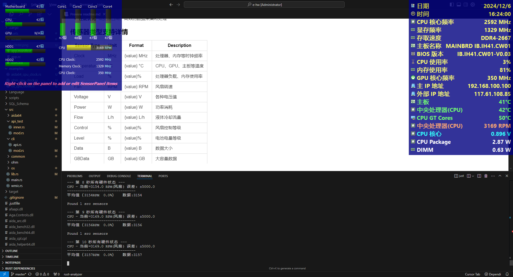

### 📄 [English](readme.md)  | 📄  [中文](readme.zh.md)
[](https://github.com/eternalnight996/hw/actions) [](https://doc.rust-lang.org/book/) [](https://github.com/eternalnight996/hw) [](https://docs.rs/rand)

# 一个强大的跨平台硬件监控工具

## 📝 项目介绍

**集成多种硬件监控后端，提供统一的命令行接口**
这是一个用 Rust 编写的硬件监控工具，支持多种监控后端和传感器类型。它可以：

- 实时监控系统硬件状态
- 支持多种硬件监控后端
  - OpenHardwareMonitor (Windows)
  - AIDA64 (Windows)
  - sysinfo (跨平台)
- 提供丰富的监控指标
  - CPU (频率、温度、负载、功耗)
  - GPU (NVIDIA/AMD 显卡状态)
  - 内存使用情况
  - 硬盘状态
  - 主板传感器
  - 风扇转速
- 统一的命令行接口
  - 简单直观的命令参数
  - 灵活的数据查询
  - 支持数据导出
  - 阈值告警功能

## 💡 主要特性

- **多后端支持**: 集成多种硬件监控解决方案，适应不同场景需求
- **跨平台兼容**: 通过 sysinfo 提供基础的跨平台支持
- **丰富的传感器**: 支持温度、频率、负载等多种传感器类型
- **实时监控**: 提供实时的硬件状态监控和数据采集
- **统一接口**: 简化的命令行接口，统一的数据格式
- **可扩展性**: 模块化设计，易于扩展新的监控后端
- **性能优化**: 低资源占用，高效的数据采集和处理

## 快速开始

**Cargo 安装示例:**
```bash
cargo install hw
```
**just 安装示例:**
```bash
git clone https://github.com/eternalnight996/hw.git
cd hw
cargo install just
just
```

**命令区别说明：**
- **data**: 仅返回传感器当前值
- **print**: 返回完整统计信息，但不做验证
- **check**: 进行值范围验证和负载测试
  - `10`: 测试次数
  - `2000`: 目标值
  - `3000`: 误差范围 (-1000~5000)
  - `100`: CPU负载百分比

---
### 📖 特性
```toml
[dependencies]
# 所有特性
hw = {version="0.1"}
# 打包所有特性
hw = {version="0.1",feature=["build","built"]}
# 只用OHM
hw = {version="0.1", default-features = false, feature=["ohm"]}
# 命令行则加上cli
# 日志 支持 log 和 tracing, cli则默认支持println输出
hw = {version="0.1", default-features = false, feature=["ohm","cli","log"]}
```

---
## 📸 界面预览与命令示例

### [1. 📖 点击Rust调用CLI](examples/cli.rs)
### [2. 📖 点击Rust调用OHM 获取CPU主频](examples/ohm_cpu_clock.rs)
### OpenHardwareMonitor 监控

**CPU Clock监控示例**

1. **data命令** - 仅返回当前值
```bash
hw --api OS --task data --args CPU Clock
```
```rust
   Compiling hw v0.1.2 (D:\MyApp\hw)
    Finished `dev` profile [unoptimized + debuginfo] target(s) in 4.18s
     Running `target\x86_64-pc-windows-msvc\debug\hw.exe --api OHM --task data --args CPU Clock`
Started OpenHardwareMonitor.exe with PID: 5332
Loading... (100%/100%)
...
--------------------------------
平均值（1068MHz  0.0%）   数据:1068

关闭负载

=== 总结 -> CPU 中央处理器 ===
--- 传感器 -> Clock 频率 MHz ---
结果: PASS
数据: 1068
目标: 0.0 MHz
平均: 1068.0 MHz
最低: 901.2 MHz
最高: 1101.5 MHz
次数: 1
错误次数: 0
负载: 0.0%
平均负载: 0.0%
允许误差: ±0.0
允许范围: 0.0 ~ 0.0 MHz
====================


R<{"content":"1068","status":true,"opts":null}>R
```

2. **print命令** - 返回完整统计信息
```bash
hw --api OHM --task print --full --args CPU Clock
```
```rust
...

R<{"content":"{\"api\":\"OHM\",\"hw_type\":\"CPU\",\"sensor_type\":\"Clock\",\"res\":\"PASS\",\"data\":\"1102\",\"min\":1101.5174560546875,\"max\":1101.5174560546875,\"avg\":1102.0,\"total\":6609.104736328125,\"samples\":6,\"test_secs\":0,\"error_count\":0,\"load\":{\"min\":0.0,\"max\":0.0,\"avg\":0.0,\"total\":0.0,\"status\":[]},\"status\":[...]}","status":true,"opts":null}>R
```

3. **check命令** - 进行值范围验证和负载测试
```bash
hw --api OHM --task check --full --args CPU Clock -- 10 2000 3000 100
```
```rust
...

--- 第 10 秒中央处理器状态 ---
CPU Core #1 - 当前=2904.0 MHz(频率) 误差: ±3000.0
CPU Core #6 - 当前=2904.0 MHz(频率) 误差: ±3000.0
CPU Core #5 - 当前=2904.0 MHz(频率) 误差: ±3000.0
CPU Core #4 - 当前=2904.0 MHz(频率) 误差: ±3000.0
CPU Core #3 - 当前=2904.0 MHz(频率) 误差: ±3000.0
CPU Core #2 - 当前=2904.0 MHz(频率) 误差: ±3000.0
--------------------------------
平均值（2904MHz  99.0%）   数据:2904

关闭负载

=== 总结 -> CPU 中央处理器 ===
--- 传感器 -> Clock 频率 MHz ---
结果: PASS
数据: 2904
目标: 2000.0 MHz
平均: 2904.0 MHz
最低: 2904.0 MHz
最高: 2904.0 MHz
次数: 10
错误次数: 0
负载: 100.0%
平均负载: 99.0%
允许误差: ±3000.0
允许范围: -1000.0 ~ 5000.0 MHz
====================


R<{"content":"{\"api\":\"OHM\",\"hw_type\":\"CPU\",\"sensor_type\":\"Clock\",\"res\":\"PASS\",\"data\":\"2904\",\"min\":2904.000732421875,\"max\":2904.001708984375,\"avg\":2904.0,\"total\":174240.07470703125,\"samples\":60,\"test_secs\":0,\"error_count\":0,\"load\":{\"min\":0.0,\"max\":0.0,\"avg\":99.0,\"total\":5946.0,\"status\":[]},\"status\":[...]}","status":true,"opts":null}>R 
```

```bash
# CPU温度监控
hw --api OHM --task check --args CPU Temperature

# CPU频率测试 (5次, 目标3000MHz, 误差±2000MHz, 100%负载)
hw --api OHM --task check --args CPU Clock -- 5 3000 2000 100

# 风扇转速测试 (5次, 目标3000RPM, 误差±2000RPM)
hw --api OHM --task check --args ALL Fan -- 5 3000 2000
```

### [3.📖 点击Rust调用OS 获取CPU主频](examples/os_cpu_clock.rs)
### sysinfo 监控

```bash
# 系统整体状态
hw --api OS --task print

# CPU负载监控
hw --api OS --task check --args CPU Load
```

### [4.📖 点击Rust调用AIDA64 获取CPU主频](examples/aida64_cpu_voltage.rs)
### AIDA64 监控

```bash
# 内存使用率监控
hw --api AIDA64 --task check --args RAM Load

# CPU核心电压监控
hw --api AIDA64 --task check --args CPU Voltage
```
### [5. 📖 点击Rust调用OSMore](examples/os_more_base.rs)
```bash
# 获取系统完整信息
hw --api OSMore --task OsFullVersion 
# 获取内存大小
hw --api OSMore --task MemoryTotal 
```
### [6. 📖 点击Rust调用微软OFFICE](examples/os_office.rs)
```bash
# 获取Office版本
hw --api OSOffice --task check-with-cache --args V2016 test
```
### [7. 📖 点击Rust调用微软系统激活](examples/os_system.rs)
```bash
# 激活系统
hw --api OSSystem --task active --args XXXXX-XXXXX-XXXXX-XXXXX-XXXXX activation_temp
# 检查系统激活状态并查询激活码缓存
hw --api OSSystem --task check-with-cache --args activation_temp
```
### [8. 📖 点击Rust调用导出DLL|SO动态链接库](examples/file_info.rs)
```bash
# 导出DLL|SO动态链接库
hw --api FileInfo --task copy-lib --args target/debug/hw.exe target/debug/_libs
# 打印文件节点
hw --api FileInfo --task print --args target/debug/hw.exe
# 打印文件节点
hw --api FileInfo --task nodes --args target/debug/hw.exe
```
### [9. 📖 点击Rust调用PING](examples/ping.rs)
```bash
# 测试PING
hw --api NetManage --task ping --args 127.0.0.1 baidu.com 3
# 测试PING节点
hw --api NetManage --task ping-nodes --args baidu.com 3
```
### [10. 📖 点击Rust调用设置DHCP](examples/dhcp.rs)
```bash
# 设置DHCP ~is_connected 是指正在连接的网卡
hw --api OSMore --task NetManage --args dhcp -- ~is_connected
```
### [11. 📖 点击Rust调用设置静态IP](examples/static_ip.rs)
```bash
# 设置静态IP
hw --api OSMore --task NetManage  --args set-ip "以太网" 192.168.1.100 255.255.255.0 192.168.1.1
# 设置DNS
hw --api OSMore --task NetManage  --args set-dns "以太网" 223.5.5.5 114.114.114.114
```
### [12. 📖 点击Rust调用桌面](examples/desktop.rs)
```bash
# 桌面节点
hw --api OSMore --task Desktop --args nodes
# 打印
hw --api OSMore --task Desktop --args print
```
### [13. 📖 点击Rust调用驱动](examples/drive.rs)
```bash
# 扫描驱动
hw --api Drive --task scan
# 驱动打印
hw --api Drive --task print -- =net "*I225-V #6"
hw --api Drive --task print -- "@pci*" "*I225-V #6"
hw --api Drive --task print -- "@pci*" "PCI*" "*E0276CFFFFEEA86B00"
  # --full 完整数据 但更消耗资源，建议加=和@去筛选
hw --api Drive --task print --full -- =net "*I225-V #6" 
  {
  "id": "PCI\\VEN_8086&DEV_15F3&SUBSYS_00008086&REV_03\\E0276CFFFFEEA86B00",
  "drive_node": "1:",
  "name": "Intel(R) Ethernet Controller (3) I225-V #6",
  "inf_file": "c:\\drivers\\lan.intel\\pro2500\\e2f68.inf",
  "inf_section": "E15F3_3.10.0.1..17763",
  "driver_descript": "Intel(R) Ethernet Controller (3) I225-V #6",
  "manufacturer_name": "Intel",
  "provider_name": "Intel",
  "driver_date": "2021/1/6",
  "driver_version": "1.0.2.13",
  "driver_node_rank": "16719872",
  "driver_node_flags": "00003044",
  "signed": false
  }
# 驱动节点
hw --api Drive --task nodes -- =net
# 导出驱动
hw --api Drive --task export --args oem6.inf D:\\drives
hw --api Drive --task export --args oem*.inf .
# 重启驱动
hw --api Drive --task restart -- =net "Intel(R) Ethernet Controller (3) I225-V #5"
hw --api Drive --task restart -- "@PCI\VEN_8086&DEV_15F3&SUBSYS_00008086&REV_03\E0276CFFFFEEA86A00"
# 启用驱动
hw --api Drive --task enable -- =net "Intel(R) Ethernet Controller (3) I225-V #5"
# 禁用驱动
hw --api Drive --task disable -- "@PCI\VEN_8086&DEV_15F3&SUBSYS_00008086&REV_03\E0276CFFFFEEA86A00"
# 删除驱动
hw --api Drive --task delete -- "@PCI\VEN_8086&DEV_15F3&SUBSYS_00008086&REV_03\E0276CFFFFEEA86A00"
# 增加驱动
hw --api Drive --task add  --args D:\\drives\\oem6.inf /install
# 增加驱动文件夹
hw --api Drive --task add-folder --args D:\\drives /install

```
### [14. 📖 点击Rust调用同步时间](examples/sync_datetime.rs)
### [15. 📖 点击Rust调用网络接口](examples/net_interfaces.rs)


---
## 🚀 开发进度
<table>
  <tr>
    <th>Backend</th>
    <th>Windows</th>
    <th>Linux</th>
    <th>MacOS</th>
    <th>Status</th>
    <th>Description</th>
    <th>支持功能</th>
  </tr>
  <tr>
    <td>OHM</td>
    <td>
      <h4 style="color:green">✓</h4>
      <span style="color:#888">100%</span>
    </td>
    <td>
      <h4>-</h4>
      <span style="color:#888">0%</span>
    </td>
    <td>
      <h4>-</h4>
      <span style="color:#888">0%</span>
    </td>
    <td><h4 style="color:green">✓</h4><span>已完成</span></td>
    <td>获取硬件传感器数据<br>完成所有功能开发</td>
    <td>HardwareType(硬件类型),SensorType(传感器类型)</td>
  </tr>
  <tr>
    <td>AIDA64</td>
    <td>
      <h4 style="color:green">✓</h4>
      <span style="color:#888">100%</span>
    </td>
    <td>
      <h4>-</h4>
      <span style="color:#888">0%</span>
    </td>
    <td>
      <h4>-</h4>
      <span style="color:#888">0%</span>
    </td>
    <td><h4 style="color:green">✓</h4><span>已完成</span></td>
    <td>获取硬件传感器数据<br>完成所有功能开发</td>
    <td>HardwareType(硬件类型),SensorType(传感器类型)</td>
  </tr>
  <tr>
    <td>OS</td>
    <td>
      <h4 style="color:green">⚡</h4>
      <span style="color:#888">10%</span>
    </td>
    <td>
      <h4 style="color:green">⚡</h4>
      <span style="color:#888">10%</span>
    </td>
    <td>
      <h4 style="color:green">⚡</h4>
      <span style="color:#888">10%</span>
    </td>
    <td><h4 style="color:blue">🔄</h4><span>测试中</span></td>
    <td>接口Rust system跨平台基础功能可用<br>支持更多的信息获取</td>
    <td>CPU,RAM</td>
  </tr>
  <tr>
    <td>OSMore</td>
    <td>
      <h4 style="color:green">⚡</h4>
      <span style="color:#888">70%</span>
    </td>
    <td>
      <h4 style="color:green">⚡</h4>
      <span style="color:#888">70%</span>
    </td>
    <td>
      <h4 style="color:green">⚡</h4>
      <span style="color:#888">70%</span>
    </td>
    <td><h4 style="color:green">✓</h4><span>已完成</span></td>
    <td>主要用于获取更多信息和管理</td>
    <td>MemoryTotal(内存大小),CpuCoreCount(CPU内核数量),OsVersion(系统版本)<br>OsFullVersion(系统版本),KernelVersion(内核版本),HostName(主机名),Uptime(开机时间)<br>CpuUsage(CPU使用率),MemoryUsage(内存使用率),CpuArch(CPU架构),UserNames(用户名),<br>NetInterface(网络接口),NetManage[网络管理(DHCP、PING、同步时间、静态IP配置)],Desktop(桌面),Drive(硬盘),</td>
  </tr>
  <tr>
    <td>Drive</td>
    <td>
      <h4 style="color:green">✓</h4>
      <span style="color:#888">100%</span>
    </td>
    <td>
      <h4 style="color:green">⚡</h4>
      <span style="color:#888">0%</span>
    </td>
    <td>
      <h4 style="color:green">⚡</h4>
      <span style="color:#888">0%</span>
    </td>
    <td><h4 style="color:green">✓</h4><span>已完成</span></td>
    <td>对接PNPUTIL和devcon</td>
    <td>scan(扫描),add-folder(添加文件),add(添加),delete(删除),delete-find(删除并查找),<br>print(打印),nodes(节点),restart(重启),enable(启用),disable(禁用),remove(移除),export(导出)</td>
  </tr>
  <tr>
    <td>FileInfo</td>
    <td>
      <h4 style="color:green">✓</h4>
      <span style="color:#888">100%</span>
    </td>
    <td>
      <h4 style="color:green">⚡</h4>
      <span style="color:#888">99%</span>
    </td>
    <td>
      <h4 style="color:green">⚡</h4>
      <span style="color:#888">99%</span>
    </td>
    <td><h4 style="color:green">✓</h4><span>已完成</span></td>
    <td>获取文件的依赖dll或so，支持一键导出依赖</td>
    <td>copy-lib(复制依赖),print(打印),nodes(列表)</td>
  </tr>
  <tr>
    <td>OSSystem</td>
    <td>
      <h4 style="color:green">✓</h4>
      <span style="color:#888">100%</span>
    </td>
    <td>
      <h4>-</h4>
      <span style="color:#888">0%</span>
    </td>
    <td>
      <h4>-</h4>
      <span style="color:#888">0%</span>
    </td>
    <td><h4 style="color:green">✓</h4><span>已完成</span></td>
    <td>系统</td>
    <td>check(检查),check-with-cache(检查并缓存),activate(激活),deactivate(注销),kms(注册kms),clear-kms(清理kms),clear-cache(清理缓存),cache-kms(缓存激活码)</td>
  </tr>
  <tr>
    <td>OSOffice</td>
    <td>
      <h4 style="color:green">✓</h4>
      <span style="color:#888">90%</span>
    </td>
    <td>
      <h4>-</h4>
      <span style="color:#888">0%</span>
    </td>
    <td>
      <h4>-</h4>
      <span style="color:#888">0%</span>
    </td>
    <td><h4 style="color:green">✓</h4><span>已完成</span></td>
    <td>Office</td>
    <td>check(检查),check-with-cache(检查并缓存),activate(激活),kms(注册kms),clear-kms(清理kms),clear-cache(清理缓存),cache-kms(缓存激活码)</td>
  </tr>
</table>

> **Note**: 
> - OpenHardwareMonitor (OHM) 和 AIDA64 仅支持 Windows 平台
> - sysinfo 支持跨平台但功能相对有限
> - 具体传感器支持可能因硬件而异


### 传感器类型支持详情
<table>
  <tr>
    <th>Sensor Type</th>
    <th>Unit</th>
    <th>Format</th>
    <th>Description</th>
  </tr>
  <tr>
    <td>Clock</td>
    <td>MHz</td>
    <td>{value} MHz</td>
    <td>处理器、内存等时钟频率</td>
  </tr>
  <tr>
    <td>Temperature</td>
    <td>°C</td>
    <td>{value} °C</td>
    <td>CPU、GPU、主板等温度</td>
  </tr>
  <tr>
    <td>Load</td>
    <td>%</td>
    <td>{value}%</td>
    <td>处理器负载、内存使用率</td>
  </tr>
  <tr>
    <td>Fan</td>
    <td>RPM</td>
    <td>{value} RPM</td>
    <td>风扇转速</td>
  </tr>
  <tr>
    <td>Voltage</td>
    <td>V</td>
    <td>{value} V</td>
    <td>各种电压值</td>
  </tr>
  <tr>
    <td>Power</td>
    <td>W</td>
    <td>{value} W</td>
    <td>功率消耗</td>
  </tr>
  <tr>
    <td>Flow</td>
    <td>L/h</td>
    <td>{value} L/h</td>
    <td>液体冷却流量</td>
  </tr>
  <tr>
    <td>Control</td>
    <td>%</td>
    <td>{value}%</td>
    <td>风扇控制等级</td>
  </tr>
  <tr>
    <td>Level</td>
    <td>%</td>
    <td>{value}%</td>
    <td>电池电量等级</td>
  </tr>
  <tr>
    <td>Data</td>
    <td>B</td>
    <td>{value} B</td>
    <td>数据大小</td>
  </tr>
  <tr>
    <td>GBData</td>
    <td>GB</td>
    <td>{value} GB</td>
    <td>大容量数据</td>
  </tr>
  <tr>
    <td>Throughput</td>
    <td>B/s</td>
    <td>{value} B/s</td>
    <td>数据吞吐量</td>
  </tr>
  <tr>
    <td>DataRate</td>
    <td>B/s</td>
    <td>{value} B/s</td>
    <td>数据传输速率</td>
  </tr>
  <tr>
    <td>SmallData</td>
    <td>B</td>
    <td>{value} B</td>
    <td>小数据包</td>
  </tr>
  <tr>
    <td>GBSmallData</td>
    <td>GB</td>
    <td>{value} GB</td>
    <td>大容量小数据包</td>
  </tr>
  <tr>
    <td>FSB</td>
    <td>MHz</td>
    <td>{value} MHz</td>
    <td>前端总线频率</td>
  </tr>
  <tr>
    <td>Multiplexer</td>
    <td>MHz</td>
    <td>{value} MHz</td>
    <td>倍频器</td>
  </tr>
  <tr>
    <td>ClockAverage</td>
    <td>MHz</td>
    <td>{value} MHz</td>
    <td>平均时钟频率</td>
  </tr>
</table>

### 硬件类型支持详情

<table>
  <tr>
    <th>Hardware Type</th>
    <th>Description</th>
    <th>Common Sensors</th>
  </tr>
  <tr>
    <td>CPU</td>
    <td>中央处理器</td>
    <td>Clock, Temperature, Load, Power</td>
  </tr>
  <tr>
    <td>RAM</td>
    <td>内存</td>
    <td>Data, Load, Clock</td>
  </tr>
  <tr>
    <td>Mainboard</td>
    <td>主板</td>
    <td>Temperature, Voltage, Fan</td>
  </tr>
  <tr>
    <td>GpuNvidia</td>
    <td>NVIDIA显卡</td>
    <td>Clock, Temperature, Load, Fan</td>
  </tr>
  <tr>
    <td>GpuAti</td>
    <td>AMD/ATI显卡</td>
    <td>Clock, Temperature, Load, Fan</td>
  </tr>
  <tr>
    <td>HDD</td>
    <td>硬盘驱动器</td>
    <td>Temperature, Load, Data</td>
  </tr>
  <tr>
    <td>SuperIO</td>
    <td>Super I/O芯片</td>
    <td>Fan, Temperature, Voltage</td>
  </tr>
  <tr>
    <td>TBalancer</td>
    <td>T-Balancer设备</td>
    <td>Fan, Flow, Temperature</td>
  </tr>
  <tr>
    <td>Heatmaster</td>
    <td>Heatmaster设备</td>
    <td>Fan, Flow, Temperature</td>
  </tr>
</table>


---
## 第三方接口版本
- OpenHardwareMonitor: v0.9.6
- AIDA64: v7.40.7100
- sysinfo: v0.33

### 关于第三方应用的说明
如果是用OHM 或 AIDA64接口，程序先会检查进程是否存在；
如果不存在则会检查当前目录是否存在 `OpenHardwareMonitor.exe` 或 `aida64.exe`

## 📊 性能基准
---
## 🦊 已运用项目
`AUTOTEST2.exe`

---
## 🔭 为什么选择这个工具？

在硬件监控领域，我们经常遇到以下挑战：
- 不同平台的监控接口差异大
- Windows下传感器数据获取复杂
- 支持Rust
- 缺乏统一的数据访问方式
- 多种监控工具切换繁琐
- 自动化测试支持有限

本工具致力于解决这些问题，提供：

### 🎯 统一的访问接口
- **命令行工具**: 简单直观的 CLI 命令
- **Rust API**: 原生的 Rust 编程接口
- **WMI 支持**: Windows 平台的 WMI 查询能力
- **Rust 支持**: Rust直接调用LIB
- **统一数据格式**: 标准化的数据输出

### 💻 多平台无缝支持
- **Windows**: 完整的传感器支持 (OHM/AIDA64)
- **Linux**: 基础系统信息监控 (sysinfo)
- **MacOS**: 基础系统信息监控 (sysinfo)

### 🔌 丰富的集成能力
- **自动化测试**: 支持自动化硬件测试场景
- **数据采集**: 灵活的数据收集和导出
- **监控告警**: 可配置的阈值监控
- **扩展接口**: 支持自定义监控后端

### 🛠️ 开箱即用
- **零配置**: 最小化配置需求
- **快速部署**: 单文件执行程序
- **向后兼容**: 保持 API 稳定性
- **完整文档**: 详细的使用说明

### 📊 典型应用场景

1. **硬件测试**
   - 产品质量验证
   - 性能基准测试
   - 稳定性测试

2. **系统监控**
   - 服务器状态监控
   - 工作站性能分析
   - 温控系统监测

3. **开发调试**
   - 硬件驱动开发
   - 性能优化分析
   - 问题诊断

4. **自动化集成**
   - CI/CD 管道集成
   - 自动化测试脚本
   - 监控系统对接

> 💡 **设计理念**: 
> - 简单易用优先
> - 统一接口标准
> - 跨平台兼容
> - 可扩展架构

---
## 🙋 参考项目与资料
- [Open Hardware Monitor 官方文档](https://openhardwaremonitor.org/)
- [Open Hardware Monitor 官方文档](https://openhardwaremonitor.org/)
- [sysinfo Crates官方](https://crates.io/crates/sysinfo)

---
## 许可证

[LICENSE](LICENSE)
[COPYRIGHT](COPYRIGHT)